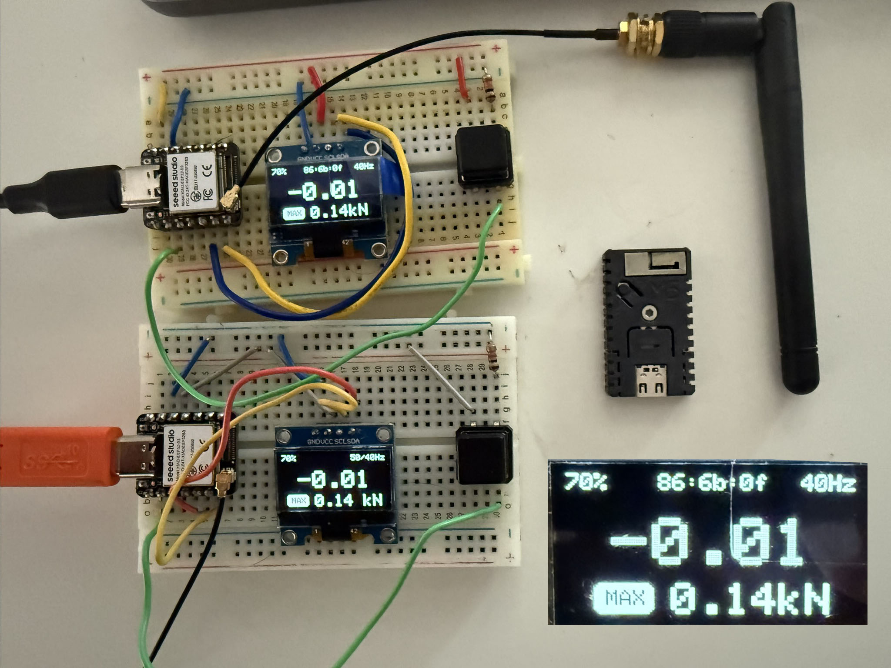
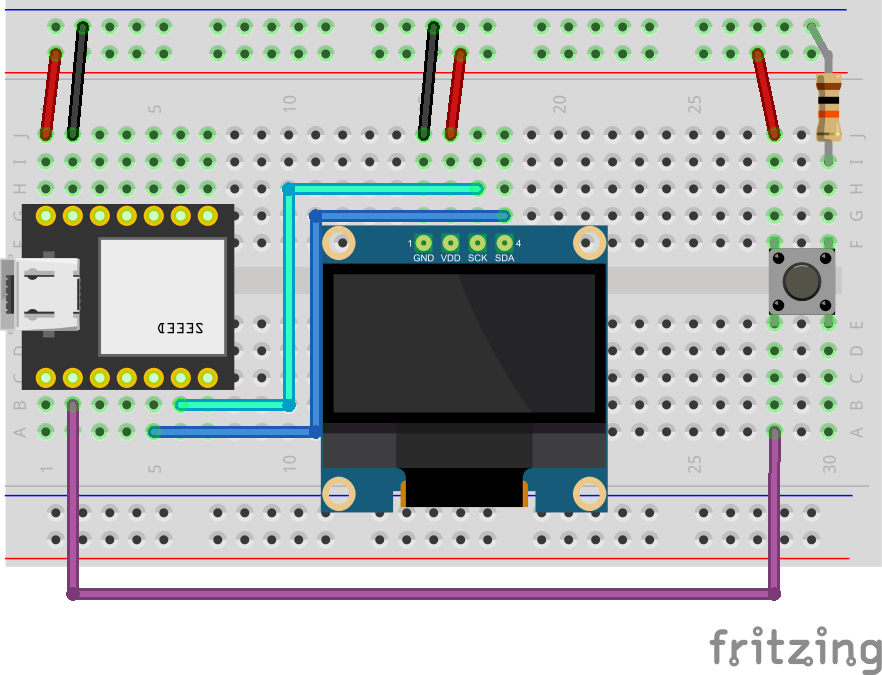

# LS3-BLE-OLED-ESPNOW

This is what started me down the path of programming for the lineScale. I wanted to get readings while on the highline but was out of range on my phone after ~20m. The sketch connects to a linescale, outputs data to an OLED screen, and broadcasts over ESPNOW. My initial range testing was 330m between a XIAO ESP32S3 base station (connected to lineScale) with a 3dBi antenna and an M5Stamp C3 with a small 3D antenna.

Button functionality (sender):
  - click: wake the screen
  - double click: reset max and min
  - hold (3 seconds) sleep the screen

### Test Setup

### Wiring diagram
- Xiao ESP32S3
- OLED 128x64 I2C
- 10kΩ resistor
- button
  

