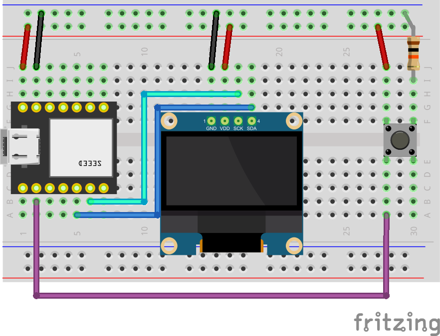

# LS3-ESPNOW-OLED

This is the ESPNOW receiver sketch for the device you want to use for viewing remote readings.

Button functionality (receiver):
  - click: wake the device
  - double click: attempt to reset max and min by sending a message over ESPNOW. note that max and min are tracked on the base station, not on this device.
  - hold (3 seconds) sleep the device

### Test Setup

### Wiring diagram
- Xiao ESP32S3
- OLED 128x64 I2C
- 10kΩ resistor
- button
  

